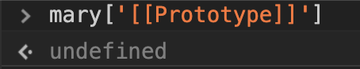
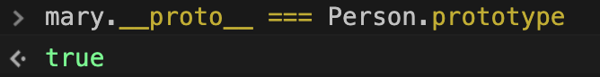
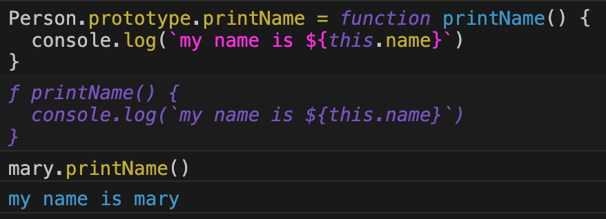
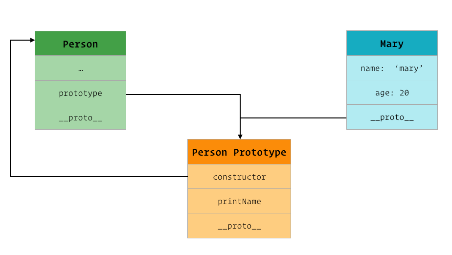
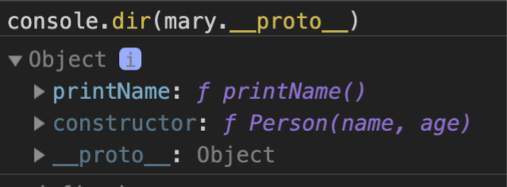
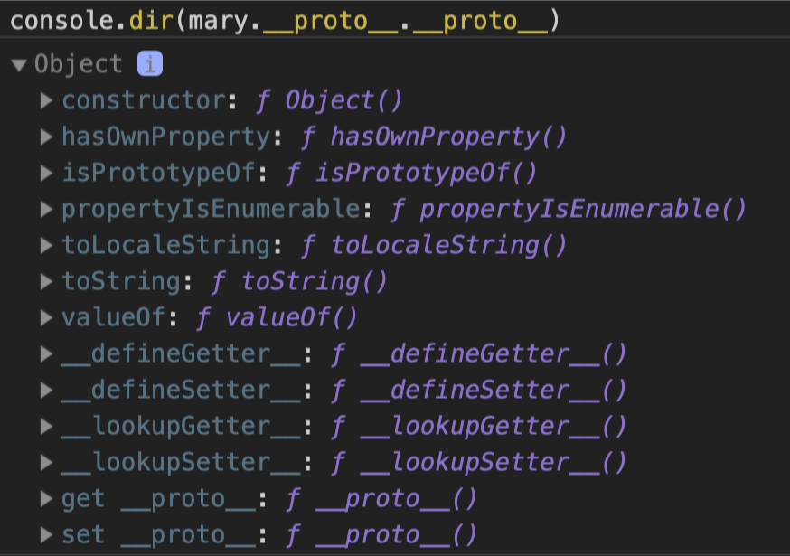
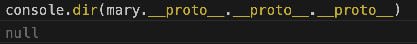
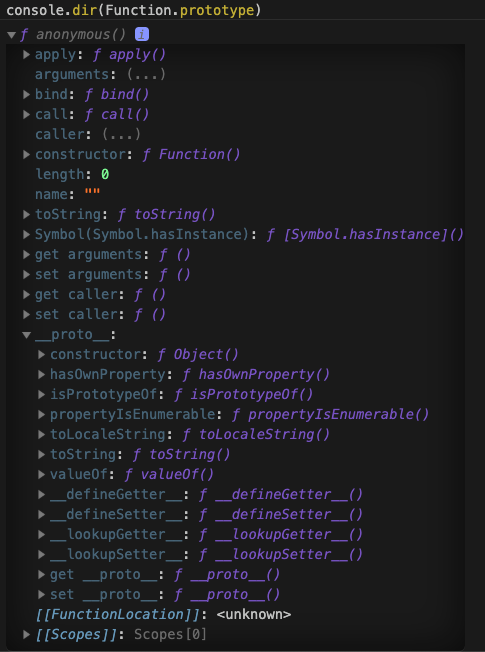

# __proto__ 和 prototype 到底有什么区别 🤔

以前在日常工作中使用 JS 时只是粗浅的知道在原型链中会存在 `__proto__` 和 `prototype` 这2个概念，但真正要回答这2个属性的具体作用以及之间的关系和差异时又总觉得不知道从哪里说起，今天就来深入研究并总结一下，希望在这篇文章结束的时候能彻底从这个坑中爬出来 🚀

## 什么是原型（prototype）？

说到 `__proto__` 和 `prototype` 就不得不提 JavaScript 中的原型，那我们先来看看原型到底是什么：

> object that provides shared properties for other objects

在 [ECMA5.1 标准](http://www.ecma-international.org/ecma-262/5.1/#sec-4.3.5)中明确定义了`原型（prototype）`是为其他对象提供共享属性的对象

从上面的定义里我们可以 get 到2个关键点：

1. 原型（prototype）的本质其实就是一个对象
2. 原型（prototype）的作用是给其他对象提供共享属性

那么问题来了，原型是怎么给其他对象提供共享属性的呢？

## JavaScript 中的继承

继续翻看 [ECMA5.1 标准](http://www.ecma-international.org/ecma-262/5.1/#sec-4.3.5)，找到如下一段文字：

> **NOTE:** When a constructor creates an object, that object implicitly references the constructor’s “prototype” property for the purpose of resolving property references. The constructor’s “prototype” property can be referenced by the program expression constructor.prototype, and properties added to an object’s prototype are shared, through inheritance, by all objects sharing the prototype. Alternatively, a new object may be created with an explicitly specified prototype by using the Object.create built-in function.
>
> **注意：** 当构造函数创建一个对象后，该对象隐式引用构造函数的 `prototype` 属性用以解决对象的属性引用。构造函数的 `prototype` 属性可以通过 `constructor.prototype` 表达式来访问，同时添加在该对象的原型里的属性会通过继承的方式与所有继承此原型的对象共享。或者，可以使用内置函数 `Object.create()` 明确指定原型来创建一个新对象

这里出现了我们想要了解的 `prototype` 属性，原来他是存在在构造函数上的一个属性。看到这里，突然冒出2个疑问：

1. 构造函数的 `prototype` 属性的值是什么呢？
2. 构造函数创建的对象是如何隐式引用构造函数的 `prototype` 属性值的？

带着疑问继续翻[文档](http://www.ecma-international.org/ecma-262/5.1/#sec-4.3.4)

> **NOTE:** The value of a constructor’s “prototype” property is a prototype object that is used to implement inheritance and shared properties.
>
> **注意：** 构造函数的 `prototype` 属性的值是用于实现继承和共享属性的原型对象

原来构造函数的 `prototype` 属性指向的就是上面提到的原型对象这个概念，OK，第一个问题解决了，构造函数的 `prototype` 属性的值就是原型对象。那么构造函数创建的对象是如何隐式引用构造函数上的原型对象呢？继续翻[文档](http://www.ecma-international.org/ecma-262/5.1/#sec-8.6.2)又找到这样一段话：

> All objects have an internal property called `[[Prototype]]`. The value of this property is either null or an object and is used for implementing inheritance. Whether or not a native object can have a host object as its `[[Prototype]]` depends on the implementation. Every `[[Prototype]]` chain must have finite length (that is, starting from any object, recursively accessing the `[[Prototype]]` internal property must eventually lead to a null value). Named data properties of the `[[Prototype]]` object are inherited (are visible as properties of the child object) for the purposes of get access, but not for put access. Named accessor properties are inherited for both get access and put access.
>
> 所有对象都有一个内部属性，称为 `[[Prototype]]`。此属性的值为 `null` 或 `一个对象`，用于实现继承。[原生对象](http://www.ecma-international.org/ecma-262/5.1/#sec-4.3.6)是否可以有一个[宿主对象](http://www.ecma-international.org/ecma-262/5.1/#sec-4.3.8)作为其 `[[Prototype]]` 取决于如何实现。每个 `[[Prototype]]` 链必须具有有限的长度 （即，从任一对象开始，递归访问 `[[Prototype]]` 内部属性必须最终到头，并且值为 `null`）。从 `[[Prototype]]` 对象继承来的命名数据属性（作为子对象的属性可见）可以通过 get 获取，但无法用于 通过 put 写入。命名访问器属性会把 get 和 put 请求都继承。

原来每个对象真正的原型是存在于其内部的 `[[Prototype]]` 属性中的。等等，前面不是提到构造函数创建的对象隐式引用了构造函数上的原型对象吗。这里又说到每个对象真正的原型是在自身的 `[[Prototype]]` 属性上，那么是否可以认为 对象的 `[[Prototype]]` 就是构造函数的 `prototype` 属性值呢？ 

首先我们创建一个构造函数 `Person`

```js
function Person(name, age) {
  this.name = name
  this.age = age
  }
```

接着我们用这个构造函数来创建一个对象 `mary`

```js
const mary = new Person('mary', 20)
```

我们先单独访问一下 `mary` 对象的 `[[Prototype]]` 属性，看看值是什么


哦吼。。报错了😱，说是语法错误。。那我们换个姿势再试一下



这次倒是不报错了，但是返回的是 `undefined` 什么鬼，跟我们的假设不一样啊！那我们到底要怎样才能真正访问到 `[[Prototype]]` 这个属性呢？还是继续翻[文档](https://www.ecma-international.org/ecma-262/5.1/#sec-8.6.2)：

> This specification uses various internal properties to define the semantics of object values. These internal properties are not part of the ECMAScript language. They are defined by this specification purely for expository purposes. An implementation of ECMAScript must behave as if it produced and operated upon internal properties in the manner described here. The names of internal properties are enclosed in double square brackets [[ ]]. When an algorithm uses an internal property of an object and the object does not implement the indicated internal property, a TypeError exception is thrown.
>
> 本规范使用各种内部属性来定义对象值的语义。这些内部属性不是 ECMAScript 语言的一部分。本规范中纯粹是以说明为目的定义它们。ECMAScript 实现需要保持和这里描述的内部属性产生和操作的结果一致。内部属性的名字用闭合双方括号 “[[ ]]” 括起来。如果一个算法使用一个对象的一个内部属性，而此对象并没有实现需要的内部属性，那么就抛出 TypeError 异常。

好么，这些内部属性原来只是给出了指导意见，具体怎么实现还要依赖各个平台。那我们就借助于万能的 google 大法来搜索下在常规浏览器中如何才能访问到 `[[Prototype]]` 这个内部属性

## 什么是 __proto__

在 google 和 MDN 上逛了一圈后发现可以通过 `__proto__` 来访问对象内部的 `[[Prototype]]` 属性，`__proto__` 属性是浏览器厂商实现的一个访问器属性（包含一个 getter 函数和一个 setter 函数）。

> **注意：** 由于在 ECMAScript 6 语言规范前，该属性从来没有被包括在 EcmaScript 语言规范中，所以不建议使用。为了确保 Web 浏览器的兼容性，`__proto__ ` 属性已在 ECMAScript 6 语言规范中标准化，建议使用  `Object.getPrototypeOf` 和 `Object.setPrototypeOf` 来进行设置或读取

现在我们重新验证一下上面的假设



正如我们设想的那样，对象 `mary` 内部的原型属性是指向其构造函数 `Person` 上的 `prototype` 属性的。既然是指向，那么如果我们给构造函数 `Person` 上的原型对象添加一个 `printName` 的方法，会不会被继承到对象 `mary` 上呢？



实验证明，对象内部的 `[[Prototype]]` 只是隐式引用了构造函数上的属性 `prototype` 的值，即原型对象。当我们去变更原型对象上的属性时，该对象内部的原型同时也会被更改。

结合上面获取到的信息，可以简单的画个关系图：



至此，终于逐步揭开了 `__proto__` 和 `prototype` 这2个属性的奥秘，它们对应的值其实都是一个原型对象，只是这个原型对象在2个不同的位置所阐述的作用不太一样：在构造函数中，它表示使用该构造函数创建的对象继承自哪个原型对象，在对象中，它用来表示该对象当前继承自哪个原型对象。

## 拓展

前面的规范里有提到这样一句话：

> 从任一对象开始，递归访问 `[[Prototype]]` 内部属性必须最终到头，并且值为 `null` 

那我们不妨用 `mary` 这个对象来验证一下

首先我们先访问下 `mary.__proto__`，得到的结果是 `Person` 函数上 `prototype` 属性的值



接着我们继续向上访问 `mary.__proto__.__proto__`，得到的结果依然是一个对象，不过这个对象上已经没有 `__proto__` 这个属性了。



那如果我们继续向上访问会得到什么呢？



我们发现正如规范里所说，原型链的尽头最终将指向 `null`。

网上关于 JS 中的原型链有一张比较经典的图


只要我们把这张图里的所有关联关系都理清楚了，那就可以算是完全掌握了 JS 中的原型概念

首先，结合规范和我们上面的验证得知，所有原型链的顶端都一定是 `null`

> Unless otherwise specified every built-in prototype object has the Object prototype object, which is the initial value of the expression Object.prototype (15.2.4), as the value of its [[Prototype]] internal property, except the Object prototype object itself.

根据上面这段话的内容可知，在 JS 中，所有对象原型链上的第一个原型对象都是 `Object 原型对象`（Objet prototype object），它同时也是表达式 `Object.prototype` 的初始值，这个初试的原型对象内部的 `[[Prototype]]` 属性值为 `null` 。

接着我们来看 `Object` 这个内置对象（图中心区域），它本身其实是对象的构造函数。平时我们在使用字面量声明一个对象时其实就相当于通过 `new Object()` 表达式来创建对象。 因此 `Object` 构造函数上的 `prototype` 属性指向上面说到的 `Object 原型对象`，又因为 `Object` 是对象的构造函数，因此 `Object 原型对象` 上的 `constructor` 属性指向构造函数 `Object`。

正如上面所说，所有的对象本质上都是由 `Object` 构造函数创建，同理，所有的函数本质上也都是由 `Function` 这个构造函数来创建的。内置对象 `Object` 本身是一个函数，所以它的原型（`[[Prototype]]`）应该等于 `Function` 的 `prototype` 属性值（为了便于区分，这个值我们叫它 `Function 原型对象`，和上面的 `Object 原型对象`呼应，图5点方向），即

```js
Object.__proto__ === Function.prototype // true
```

视线转移到构造函数 `Function` (图6点方向)，和 `Object` 一样，因为它本身也是一个函数，所以它的原型也等于 `Function 原型对象`，而它又是其他自定义函数的构造函数，因此 `Function 原型对象`上的 `constructor` 属性指向构造函数 `Function`。

构造函数 `Function` 是函数，所以它的原型（`[[Prototype]]`）等于 `Function 原型对象`。

这里我们会发现一个比较有意思的地方，内置对象 `Function` 的 `prototype` 属性和其内部的 `[[Prototype]]` 属性指向的是同一个东西 `Function 原型对象`，我们不妨在控制台上把它打印出来看看它到底有什么特别



其他的构造函数上的 `prototype` 指向的都是一个对象，为什么这里会是一个匿名函数呢？

在[文档](http://www.ecma-international.org/ecma-262/5.1/#sec-15.3.4)中一番摸爬滚打后找到了如下内容：

> The Function prototype object is itself a Function object (its [[Class]] is "Function") that, when invoked, accepts any arguments and returns undefined.
>
> The value of the [[Prototype]] internal property of the Function prototype object is the standard built-in Object prototype object (15.2.4). The initial value of the [[Extensible]] internal property of the Function prototype object is true.
>
> The Function prototype object does not have a valueOf property of its own; however, it inherits the valueOf property from the Object prototype Object.

原来 `Function 原型对象` 继承于 `Object 原型对象`，但是它可以像普通函数一样调用，返回值是 `undefined`，同时它有别于其他函数，自身不存在 `prototype` 这个属性，所以 `Function 原型对象` 是一个另类的函数，可以独立于（先于）`Function` 产生。

搞清了上面这部分内容，其他的就很简单了，比如自定义构造函数 `Foo` （图12点方向），因为它是函数，所以继承自 `Function`，即 `Foo` 的内部属性 `[[Prototype]]` 指向 `Function 原型对象`；`Foo` 的 `prototype` 属性指向通过 `Foo` 构造函数创建出的新对象（`f1`，`f2`）的原型（内部属性 `[[Prototype]]`），即

```js
Foo.prototype === f1.__proto__ // true
```

同时，因为 Foo.prototype 继承自 `Object 原型对象`，因此

```js
Foo.prototype.__proto__ === Object.prototype // true
```

剩下的 `o1`，`o2`（图9点方向）同理，这里就不赘述了，感兴趣的同学可以自己尝试解释一下。

## 总结

* `__proto__` 存在于所有对象上，`prototype` 只存在于函数上
* `__proto__` 用来表示当前对象的原型对象是什么，在检索属性时方便在原型链上递归向上去查找，实现了 `obj.__proto__.__proto__...` 原型链
* `prototype` 用来表示使用此构造函数初始化的对象继承自哪个原型对象
* `__proto__` 并不是 ECMAScript 语法规范的标准，只是浏览器厂商实现的一种便于访问或修改对象内部 `[[Prototype]]` 的访问器属性，建议使用 `Object.getPrototypeOf` 替代
* `prototype` 是 ECMAScript 语法规范的标准

顺带总结一波原型

* 每个对象内部都有一个用来存放该对象原型的内部属性 `[[Prototype]]`，可以通过 `obj.__proto__` 或 `Object.get​PrototypeOf / Object.setPrototypeOf` 来读写。
* 原型的本质是对象，每个原型对象自身也可能存在原型，以此类推形成原型链。
* 原型链的长度是有限的，且最终一定指向 `null`。
* 所有原型对象的根原型对象是 `Object 原型对象`, 它被内置在 `Object.prototype` 属性上。
* 每个函数自身都会有一个 `prototype` 属性，用来给其创建的对象赋予原型（即设置其创建的对象的内部属性 `[[Prototype]]`）。
* 函数 `prototype` 属性值的 `constructor` 属性指向自身。
* 构造函数 `Function` 的 `prototype` 属性和其原型（`__proto__`）都指向 `Function 原型对象`。
* `Function 原型对象` 比较特殊，是一个匿名函数，它可以先于/独立于 `Function` 产生，其原型依然是 `Object 原型对象`


## 参考文档

> * [ECMAScript® Language Specification -- Standard ECMA-262 5.1 Edition / June 2011](https://www.ecma-international.org/ecma-262/5.1)
> * [Internal and external prototype](https://wiki.duktape.org/internalexternalprototype)