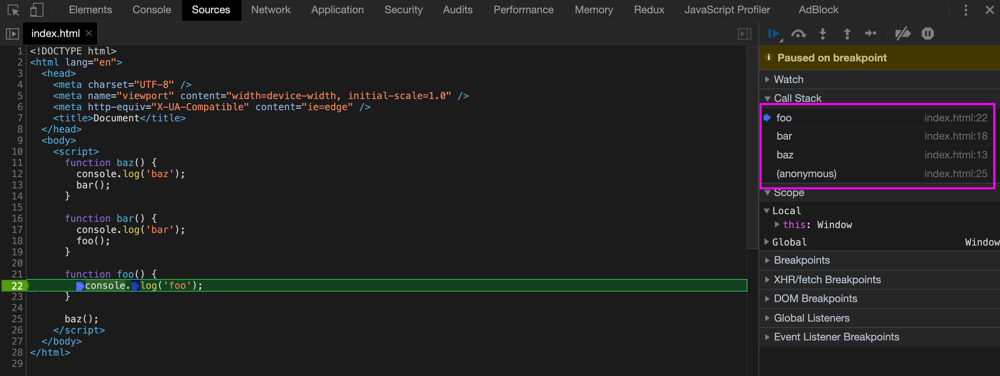

# 深入理解 Javascript 中的 this

## this 是什么

`this` 在 `javascript` 语言中是一个关键字，它的值指向当前执行上下文（execution context）的 `thisBinding` 的值。

每个执行上下文都包含了跟踪相关代码的执行进度所需的所有状态和信息（比如在哪里被执行，执行方式，执行函数时传入的参数等），同时还包含 `词法环境（LexicalEnvironment）` 、 `变量环境（VariableEnvironment）` 、 `ThisBinding` 这3个状态组件 ，其中 `ThisBinding` 的值取决于函数调用时的各种条件。

综上，简单概括 `this` 相当于执行上下文的一个属性，用来指代某个对象以便于我们可以简单的进行复用。但具体指代什么对象则由执行上下文所决定。

## this 的指向

首先强调 2 个容易产生的误解：

1. 不是恒定的指向自身
2. 不是在所有情况下都指向所在函数的作用域

在 `javascript` 中 `this` 并不是在代码编写时（ES6 中的箭头函数除外）就确定具体值的，而是取决于函数在哪里被调用。

函数的调用位置可以通过分析调用栈来得到，即当前正在执行的函数的前一个调用

```js
function baz() {
  console.log('baz')
  
  bar()
}

function bar() {
  console.log('bar')
  
  foo()
}

function foo() {
  console.log('foo')
}

baz()
```

分析一下上面的代码，首先我们在全局环境下调用了 `baz` 这个函数，此时调用位置是全局作用域，当前调用栈是 `baz` ，接着在 `baz` 中调用 `bar` ，此时调用栈是 `baz` -> `bar` ，调用位置是 `baz` ，最后在 `bar` 中调用 `foo` ，此时调用栈是 `baz`  -> `bar`  -> `foo` ，调用位置是 `bar`



## 绑定规则

### 默认绑定

独立函数调用，在其他绑定规则无法应用时生效

```js
function foo() {
  console.log(this.a)
}

var a = 1

foo() // 1
```

上面的 `foo` 函数在调用时没有经过任何修饰，直接在全局作用域下被调用，因此应用默认绑定规则，此时 `foo` 中的 `this` 指向全局对象。 `var a = 1` 语句相当于给全局对象的 `a` 属性赋值 `1`，因此 `foo` 中打印出的结果是 `1`。

**例外：**

如果在 `foo` 函数内使用了严格模式，则不能将全局对象用于默认绑定。

```js
function foo() {
  'use strict'
  
  console.log(this.a)
}

var a = 1

foo() // this is undefined
```

值得一提的是，默认绑定能否绑定到全局对象只取决于 `foo` 内部是否运行在严格模式下，而 `foo` 是否是在严格模式下被调用则不会对绑定到全局对象产生影响。

```js
function foo() {
  console.log(this.a)
}

var a = 1

(function() {
  'use strict'
  
  foo() // 1
})()
```

**注意：** 独立调用与函数所处的位置无关，比如：

```js
function foo() {
  var a = 2
  
  function bar() {
    console.log(this.a)
  }
  
  bar()
}

var a = 1

foo() // 1
```

### 隐式绑定

函数被调用时如果存在上下文对象，隐式绑定规则会将函数中的 `this` 绑定到这个上下文对象上。

```js
function foo() {
  console.log(this.a)
}

var obj = {
  a: 1,
  bar: foo
}

obj.bar() // 1
```

上面的代码里，函数 `foo` 实际上是通过对象 `obj` 的 `bar` 属性引用后调用的，此时存在上下文对象 `obj` ， `foo` 函数里的 `this` 此时被隐式绑定在对象 `obj` 上，所以控制台输出的 `this.a` 相当于 `obj.a` ，即为 `1`。

再看一个稍微复杂一点的 🌰：

```js
function foo() {
  console.log(this.a)
}

var obj1 = {
  a: 1,
  bar: foo
}

var obj2 = {
  a; 2,
  obj1: obj1
}

obj2.obj1.bar() // 1
```

这段代码里，最终函数 `foo` 还是通过 `obj1` 的对象 `bar` 来调用的，因此最终输入的结果是 `1`。这里需要注意的是对象属性引用链上只有最后一层在调用位置中起作用。

#### 隐式丢失

在隐式绑定规则中有一个较为常见的问题是隐式丢失，即隐式绑定的函数应用了默认绑定规则，从而导致丢失了原本被绑定的对象。

```js
function foo() {
  console.log(this.a)
}

var obj = {
  a: 1,
  bar: foo
}

var baz = obj.bar

var a = 2

baz() // 2
```

虽然从代码上看变量 `baz` 是对 `obj.bar` 的引用，但实际上 `baz` 和 `obj.bar` 都是对函数 `foo` 的直接引用，因此 `baz` 实际上就是不带任何修饰的函数 `foo` 调用，所以应用了默认绑定。

还有一种比较常见的情况是回调函数，比如：

```js
function foo() {
  console.log(this.a)
}

var obj = {
  a: 1,
  bar: foo
}

var a = 2

setTimeout(obj.bar, 1000) // 2
```

上面的回调函数也会出现隐式绑定丢失的问题，根本原因是把函数当作参数传递给另一个函数时本质上其实就是一种隐式赋值，类似于前一个例子中的 `var baz = obj.bar`，因此结果和上一个例子一致。

### 显式绑定

在 `JavaScript` 的宿主环境中会有一个 `Function.prototype` 对象，所有原型链上存在该对象的函数都可以调用 `.call`、`.apply` 和 `.bind` 这 3 个方法，通过这3个方法，我们都可以显式的将我们希望绑定的内容通过参数的形式传递和绑定给模板函数的 `this`

```js
function foo() {
  console.log(this.a)
}

var obj = {
  a: 1
}

var a = 2

foo.call(obj) // 1
foo.apply(obj) // 1
foo.bind(obj)() // 1
```

#### call 和 apply

从 `this` 绑定的角度来说, `call` 和 `apply` 是一样的效果，只是他们的参数有一些区别，第一个参数的作用都是用来改变上下文对象的，不同的是从第二个参数开始，如果目标函数接收多个参数，通过 `call` 方法需要同样以多个参数的形式进行传递，而使用 `apply` 方法则可以通过传递一个数组形式的值来将数组中的值分发到目标函数的各个参数。

举个 🌰：

```js
// 求一个数组内的最大值

var arr = [5, 1, 30, 2, 14]

Math.max.call(null, 5, 1, 30, 2, 14) // 30
Math.max.call(null, ...arr) // 30
Math.max.call(null, arr) // NaN
Math.max.apply(null, arr) // 30
```

#### bind

`call` 和 `apply` 虽然可以帮助我们显示的指定 `this` 的具体指向，但是依然没法解决我们前面提出的隐式丢失的问题，除非我们在调用 `baz` 的时候通过 `baz.call(obj)` 这样的形式。如果我们想通过 `baz()` 这样简单的的调用形式来实现 `this` 绑定的变换，就需要用到 `.bind` 这个方法了。

```js
function foo() {
  console.log(this.a)
}

var obj = {
  a: 1,
  bar: foo
}

var a = 2

var baz = foo.bind(obj)
baz() // 1

var bat = obj.bar.bind(obj)
bat() // 1
```

**注意：** 如果在使用 `call/bind/apply` 时传入的第一个参数是非空的基本数据类型（字符串，数字，布尔），那么最终 `this` 绑定的值会指向这些基本数据的对象形式（如`String('123')`，`Number(123)`，`Boolean(false)`）。

### new 绑定

在 `JavaScript` 中使用 `new` 关键字执行函数时也会发生 `this` 指向的变更，在明确 `this` 指向前，我们先来看看使用 `new` 调用函数的时候会执行哪些操作

1. 创建一个全新的对象
2. 给新对象的内部属性 `[[prototype]]` 赋值
3. 将新对象绑定到函数调用的 `this`
4. 如果函数没有返回其他对象，则自动返回新创建的这个对象

```js
function foo(a) {
  this.a = a
}

var bar = new foo(1)
console.log(bar.a) // 1
```

上面的代码中我们用 `new` 来调用函数 `foo`  时，会创建一个新对象并且绑定到 `this` 上，因为 `foo` 内部没有返回任何内容，因此最终返回了这个新创建的对象。

如果被调用的函数内部有显示返回对象类型，则会直接返回这个对象，如果显示返回的值是基本类型，则返回最初创建的对象

```js
function foo1(a) {
  this.a = a

  return {
    a: 2
  }
}

var bar1 = new foo1(1)
console.log(bar1.a) // 2

function foo2(a) {
  this.a = a

  return 'hello world'
}

var bar2 = new foo2(1)
console.log(bar2.a) // 1
```

### 箭头函数中的绑定

箭头函数中的 `this` 绑定不遵从上述任一原则，而是根据外层函数作用域或全局作用域来决定的。

```js
function foo() {
  return () => {
    console.log(this.a)
  }
}

var obj1 = {
  a: 1
}

var obj2 = {
  a; 2
}

var bar = foo.call(obj1)
bar.call(obj2) // 1
```

在上面的代码中，`foo` 内部的箭头函数会捕获 `foo` 被调用时其内部的 `this` 的值，即变量 `bar` 所引用的箭头函数中的 `this` 会被绑定到调用 `foo` 函数时，`foo` 内部的 `this` 值 `obj1`。

上面的代码约等于：

```js
function foo() {
  var self = this

  return function() {
    console.log(self.a)
  }
}

var obj1 = {
  a: 1
}

var obj2 = {
  a: 2
}

var bar = foo.call(obj1)
bar.call(obj2) // 1
```

**注意：** 箭头函数绑定的 `this` 无法被修改，即使是 `new` 也不行。

## this 绑定更改的优先级

### `箭头函数` VS `其他`

先来看下在浏览器环境中执行下面代码后的结果

```js
var foo = () => {
  console.log(this)
}

var obj = {
  bar: foo
}

foo() // Window
obj.bar() // Window
foo.call(obj) // Window
foo.apply(obj) // Window
foo.bind(obj)() // Window
var bar = new foo() // TypeError: foo is not a constructor
```

从上面的测试结果可以看到，箭头函数的 `this` 绑定规则优先级最高。

### `new 绑定` VS `显示绑定`

由于 `call` 和 `apply` 都不能被当作构造函数使用（规范限定），因此无法直接通过 `new foo.call(obj1)` 这样的形式来直接测试，但是 `bind` 函数会返回一个已经被更改绑定 `this` 到指定值的函数，因此我们可以通过对比 `new` 和被 `bind` 之后的函数来进行验证。

```js
function foo(value) {
  this.a = value
}

var obj1 = {}

var bar = foo.bind(obj1)
bar(1)
console.log(obj1.a) // 1

var baz = new bar(2)
console.log(baz.a) // 2
console.log(obj1.a) // 1
```

从上面的例子中可以看到，在对被 `bind` 更改过 `this` 指向的函数进行 `new` 调用后，`this` 的指向再次发生了更改，因此 `new绑定` 的优先级要高于 `显示绑定`。

### `bind` VS `call/apply`

在显示绑定中我们可以通过 `bind`，`call`，`apply` 对函数中的 `this` 指向进行变更，那么他们之间的优先级是否相同呢

```js
function foo() {
  console.log(this.a)
}

var a = 0

var obj1 = {
  a: 1,
  bar: foo
}

var obj2 = {
  a: 2
}

foo.call(obj1) // 1

var baz = foo.bind(obj2)
baz.call(obj1) // 2
baz.apply(obj1) // 2

var tmp = baz.bind(obj1)
tmp() // 2
```

上面的例子可以看到，被 `bind` 更改过 `this` 指向的函数 `baz`，再次调用 `call/apply/bind` 进行更改 `this` 的行为都会失效，因此 `bind` 的优先级要高于 `call/apply`

### `显式绑定` VS `隐示绑定`

```js
function foo() {
  console.log(this.a)
}

var obj1 = {
  a: 1,
  bar: foo
}

var obj2 = {
  a: 2,
  bar: foo
}

obj1.bar() // 1
obj2.bar() // 2

obj1.bar.call(obj2) // 2
obj2.bar.call(obj1) // 1

var baz = obj1.bar.bind(obj2)
baz() // 2
```

从上面的例子可以看到 `显示绑定` 的规则优先级是要高于 `隐式绑定` 规则的。

**注意：** 我们在使用 `call/apply/bind` 函数的时候是可以**不给**第一个参数传值或者是传 `null` 的，发生这种情况时 `this` 指向又会发生什么变化呢？

```js
function foo() {
  console.log(this.a)
}

var a = 0

var obj1 = {
  a: 1,
  bar: foo
}

var obj2 = {
  a: 2
}


foo() // 0
foo.call() // 0
foo.apply() // 0
foo.bind()() // 0
foo.call(null) // 0
foo.apply(null) // 0
foo.bind(null)() // 0

obj1.bar() // 1
obj1.bar.call() // 0
obj1.bar.apply() // 0
obj1.bar.bind()() // 0
obj1.bar.call(null) // 0
obj1.bar.apply(null) // 0
obj1.bar.bind(null)() // 0
```

根据上面的代码可以看到如果我们在调用 `call/apply/bind` 时不传第一个参数或者第一个参数的值是 `null` 时，此时的 `this` 都会应用 `默认绑定` 规则。

### 总结

结合上面各种情况的呈现，我们可以来总结一下判断 `this` 的顺序：

1. 函数是否是箭头函数？如果是的话，那么 `this` 绑定的值取决于箭头函数外部函数作用域或者全局作用域。
2. 函数是否被当作构造函数在 `new` 中被调用？如果是，那么 `this` 绑定的是通过 `new` 内部行为新创建的对象。
3. 函数是否通过 `bind` 进行过 `this` 绑定且传入的 `this` 参数不为 `undefined` 或 `null` ？如果是，那么 `this` 绑定的值是调用 `bind` 时传入的第一个参数值。
4. 函数是否通过 `call/apply` 进行调用且传入的 `this` 参数不为 `undefined` 或 `null`？如果是，那么 `this` 绑定的值是调用 `call/apply` 时传入的第一个参数值。
5. 函数是否在某个上下文对象中调用？如果是，那么 `this` 绑定的是这个上下文对象。
6. 如果都不是，使用默认绑定，函数体内如果是严格模式，`this` 绑定的是 `undefined`，如果是非严格模式，`this` 绑定的是全局对象。

最后用一些测试用例来佐证上面的结论

```js
var a = 0

var foo1 = () => {
  console.log(this)
}

var obj1 = {
  name: 'obj1',
  foo: foo1
}

foo1() // 全局对象
foo1.bind(obj1)() // 全局对象
foo1.call(obj1) // 全局对象
foo1.apply(obj1) // 全局对象
obj1.foo() //
// var foo1 = new foo() // TypeError, foo is not a constructor

function foo2(value) {
  this.a = value
}

var obj2 = {
  a: 2,
  foo: foo2
}
var obj3 = {
  a: 3
}

const tmp1 = new foo2(1)
console.log(tmp1.a) // 1
const tmp2 = new obj2.foo(1)
console.log(tmp2.a) // 1
const tmp3 = new (foo2.bind(obj3))(3)
console.log(tmp3.a) // 3

function foo3() {
  console.log(this)
}

var obj4 = {
  a: 4,
  foo: foo3
}

var foo4 = foo3.bind(obj4)

var obj5 = {
  foo: foo4
}


foo4() // obj4
foo4.call(obj3) // obj4
foo4.apply(obj3) // obj4
obj5.foo.call(obj3) // obj4
obj5.foo.apply(obj3) // obj4
obj5.foo.bind(obj3)() // obj4

var obj6 = {
  a: 6,
  foo: foo3
}

foo3.call(obj6) // obj6
foo3.apply(obj6) // obj6
obj6.foo.call(obj3) // obj3
obj6.foo.apply(obj3) // obj3
obj6.foo.bind(obj3)() // obj3

foo3() // 全局对象
foo3.call() // 全局对象
foo3.apply() // 全局对象
foo3.call(null) // 全局对象
foo3.apply(null) // 全局对象
foo3.bind(null)() // 全局对象

var foo6 = obj6.foo
foo6() // 全局对象
```

（完）

## 参考文档

> [You Don't Know JS: this & Object Prototypes](https://github.com/getify/You-Dont-Know-JS/tree/master/this%20%26%20object%20prototypes)